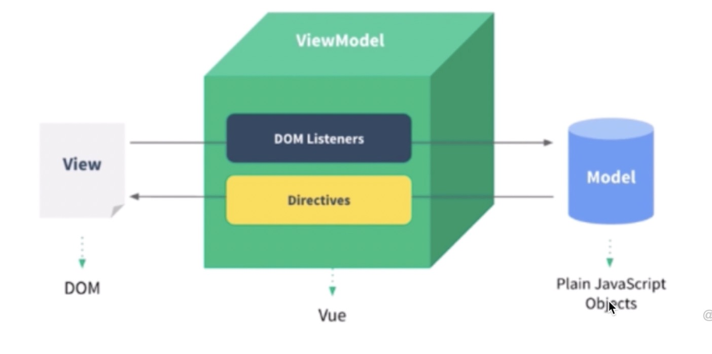

# MVVM

## 组件化基础

### "很久以前" 的组件化

- `asp jsp php` 已经有的组件化了
- `nodejs`中也有类似的组件化(模板渲染)

- - -
### 数据驱动视图

- 传统组件，只是静态渲染，更新还要依赖于操作DOM
- 数据驱动视图 - `Vue MVVM`
- 数据驱动视图 - `React setState`

- - -

### Vue MVVM(数据驱动视图)

- `View` - Dom
- `Model` - 状态（数据）
- `ViewModel` - Vue框架提供的自动监听Dom和状态的双向变化而进行更新渲染

