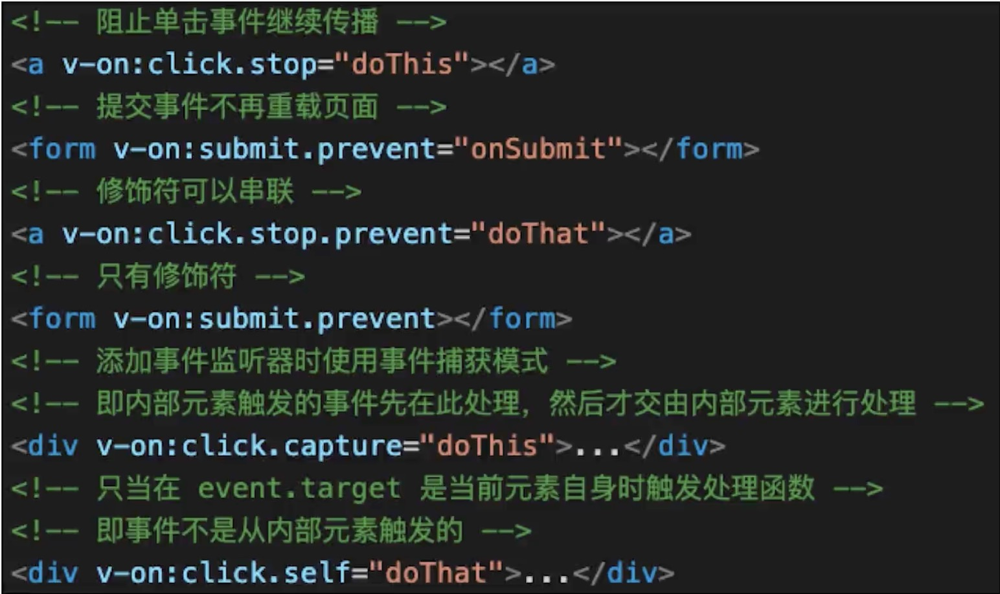
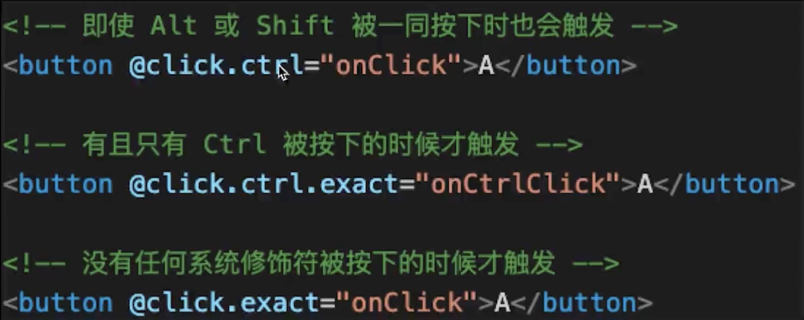

## Vue2基础使用

### 指令、差值

- 差值、表达式
- 指令、动态属性
- `v-html`: 会有XSS风险，会覆盖子组件

[demo](demo代码/BaseUse/TplDemo.vue)

- - -

### computed和watch

- **computed有缓存，data不变则不会重新计算**
- watch只是浅监听
- **watch监听引用类型，拿不到olVal**

[computed Demo](demo代码/BaseUse/ComputedDemo.vue)

[watch Demo](demo代码/BaseUse/WatchDemo.vue)

- - -

### class和style

- 使用动态属性
- 使用驼峰式写法

[Demo](demo代码/BaseUse/ClassDemo.vue)

- - -

### 条件渲染

- `v-if v-else`的用法，可使用变量，也可以使用`===`表达式
- **`v-if`和`v-show`的区别?**
  - `v-if`会严格按条件渲染`true`就渲染
  - `v-show`都会渲染，不满足条件的会把该标签的样式`display: none`
- **`v-if`和`v-show`的使用场景?**
  - `v-if`会频繁创建和销毁元素标签，而`v-show`只是修改标签样式。
  - 渲染不是很频繁的情况下使用`v-if`,减少性能损耗
  - 渲染频繁时渲染`v-show`，减少性能损耗
- `v-if`会创建和销毁组件，`v-show`是利用`css`的`display`属性来控制展示和隐藏的

[Demo](demo代码/BaseUse/ConditionDemo.vue)

- - -

### 循环（列表）渲染

- 如何遍历对象? —也可以使用`v-for`
- **`key`很重要，`key`不能乱写(如`random`或者`index`)**
- **`v-for`和`v-if`不能一起使用！**

[Demo](demo代码/BaseUse/ListDemo.vue)

- - - 

### 事件

- 事件修饰符，按键修饰符
- `event`参数，自定义参数
- **【观察】事件绑定到哪里？（对比React）**
  - **当事件不需要参数时候`event`直接取得**
  - **当事件需要传入参数时候`event`需要手动传入**
  - **`event.target`是绑定事件的元素**
  - **1.`event`是原生的`event`对象没有进行任何的装饰**
  - **2.事件被绑定到当前元素**

[Demo](demo代码/BaseUse/EventDemo.vue)

- - -

### 事件修饰符

- - -

### 按键修饰符

- - - 

### 表单

- `v-model`
- 常见表单项 `textarea checkbox radio select`
- **修饰符`lazy number trim`**
  - **`lazy`防抖的效果，输入中没有变化，输入完发生变化**
  - **`trim`去左右空格**
  - **`number`是转化成数字**

[Demo](demo代码/BaseUse/FormDemo.vue)

- - -
